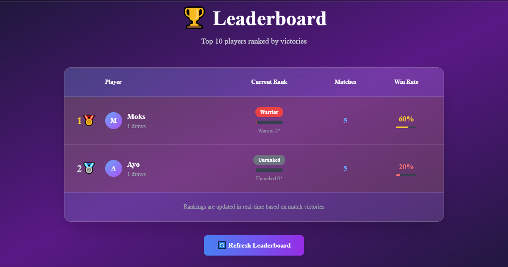

# TicTacToe Multiplayer Game

<p>
  
</p>

A full-stack TypeScript application featuring real-time multiplayer TicTacToe with matchmaking, game state persistence, and match history.

## Features

- **Real-time Multiplayer**: WebSocket-based real-time gameplay
- **Matchmaking System**: Queue-based matchmaking with skill-based matching
- **Game State Persistence**: Automatic game state restoration after disconnection
- **Match History**: Complete match records stored in database
- **Auto-close Timer**: Configurable timer for automatic match cleanup
- **Responsive UI**: Modern, responsive design with Tailwind CSS

## Tech Stack

### Backend
- **Node.js** with **Express**
- **TypeScript** for type safety
- **Socket.IO** for real-time communication
- **MongoDB** with **Mongoose** for data persistence
- **JWT** for authentication

### Frontend
- **Next.js** with **React**
- **TypeScript** for type safety
- **Tailwind CSS** for styling
- **Zustand** for state management
- **Socket.IO Client** for real-time communication

## Environment Variables

Create a `.env` file in the root directory with the following variables:

```env
# Server Configuration
APP_PORT=5000

# Database Configuration
DATABASE_CONN_URL=mongodb://localhost:27017/t3

# JWT Configuration
ACCESS_TOKEN_SECRET=your_jwt_secret_here
REFRESH_TOKEN_SECRET=your_jwt_secret_here
```

### Generate JWT secrets using utility script

You can auto-generate and append JWT secrets to your `.env` using the provided script at the project root:

```bash
node gt.js
```

This will append `ACCESS_TOKEN_SECRET` and `REFRESH_TOKEN_SECRET` values to `.env` (creating the file if missing). If you run it multiple times, it will append additional lines; clean up duplicates if needed.

## Installation

1. Clone the repository
2. Install dependencies:
   ```bash
   npm install
   cd client && npm install
   ```
3. Set up your environment variables
   - Optionally generate JWT secrets via:
     ```bash
     node gt.js
     ```
4. Start the development servers:
   ```bash
   # Start backend server
   npm run dev
   
   # Start frontend server (in another terminal)
   cd client && npm run dev
   ```

## Game Features

### Matchmaking
- Players join a matchmaking queue
- Skill-based matching algorithm
- Queue time tracking
- Automatic match creation

### Gameplay
- Real-time move synchronization
- Turn-based gameplay enforcement
- Win condition detection
- Draw detection

### Match Management
- **Auto-close Timer**: Matches automatically close after a configurable time (default: 15 seconds)
- **Game State Cleanup**: Complete state cleanup when players exit matches
- **Match History**: All matches are stored with:
  - Player IDs and usernames
  - Final board state
  - Complete game steps
  - Match duration
  - End reason (victory, surrender, timeout, disconnect)

### State Persistence
- Game state automatically saved during gameplay
- State restoration after disconnection
- Clean state management on match exit

## API Endpoints

### Authentication
- `POST /api/v1/auth/register` - User registration
- `POST /api/v1/auth/login` - User login
- `POST /api/v1/auth/logout` - User logout

### WebSocket Events
- `authenticate` - Authenticate user connection
- `join_matchmaking` - Join matchmaking queue
- `leave_matchmaking` - Leave matchmaking queue
- `make_move` - Make a game move
- `surrender` - Surrender current match

## Database Schema

### Users
- `_id`: ObjectId
- `username`: String (unique)
- `email`: String (unique)
- `password`: String (hashed)

### Matches
- `_id`: ObjectId
- `playerOne`: ObjectId (ref: User)
- `playerTwo`: ObjectId (ref: User)
- `victor`: ObjectId (ref: User, optional)
- `duration`: Number (milliseconds)
- `startedAt`: Date
- `endedAt`: Date
- `gameSteps`: Array of board states
- `finalBoardState`: Final board configuration
- `endReason`: String (victory, surrender, timeout, disconnect)

## Development

### Project Structure
```
├── client/                 # Next.js frontend
│   ├── src/
│   │   ├── app/           # App router pages
│   │   ├── components/    # React components
│   │   ├── store/         # Zustand stores
│   │   └── lib/           # Utilities
├── src/                   # Backend source
│   ├── config/            # Configuration files
│   ├── db/                # Database models
│   ├── routes/            # API routes
│   └── tictactoe/         # Game logic
└── dist/                  # Compiled JavaScript
```

## UI Preview

<p>
  
</p>

<p>
  
</p>

<p>
  
</p>

<p>
  
</p>

<p>
  
</p>

<p>
  
</p>

<p>
  
</p>

### Scripts
- `npm run dev` - Start backend development server
- `npm run build` - Build backend for production
- `npm run start` - Start production backend server
- `cd client && npm run dev` - Start frontend development server
- `cd client && npm run build` - Build frontend for production

## Contributing

1. Fork the repository
2. Create a feature branch
3. Make your changes
4. Add tests if applicable
5. Submit a pull request

## License

This project is licensed under the MIT License.
